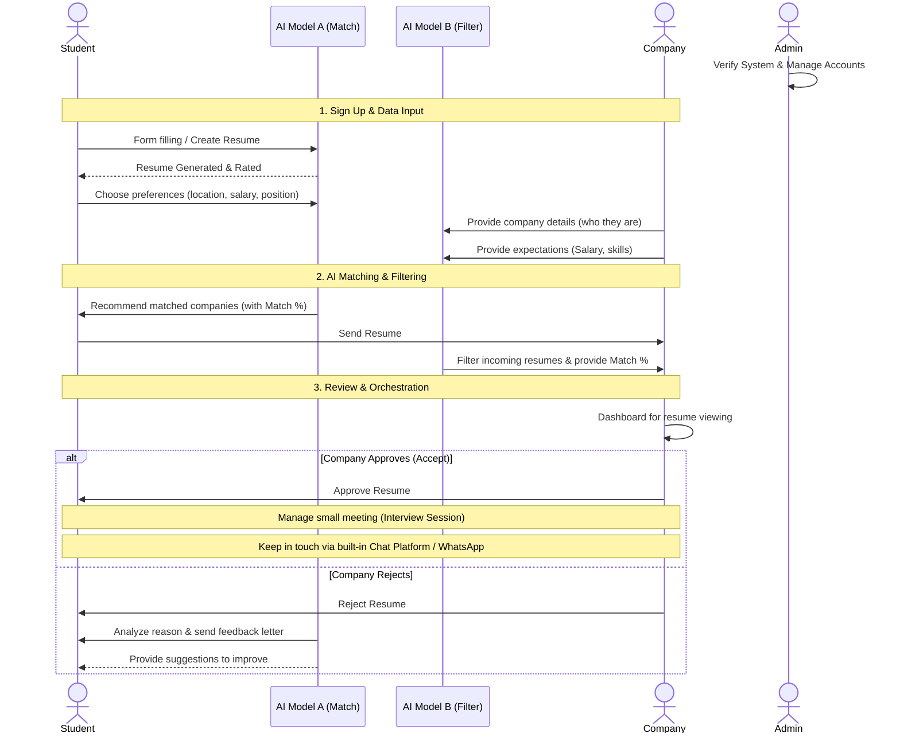

# FutureJobSenpai: End-to-End System Workflow

Based on the team's requirements draft, here is the updated workflow. It resolves previous conflicts and ensures every feature mentioned is accounted for.

## Complete Workflow Diagram

---

## Detailed Breakdown & Data Flow

### 1. Admin View
* **Verify System:** General monitoring of the platform's health.
* **Manage Account:** Handling user accounts (especially verifying/inviting companies).

### 2. The Student Layer 
* **Workflow:** Sign up -> Create resume -> Choose preferences -> Apply.
* **Features:** 
    * Resume Generating & Rating.
    * **AI Model A:** Recommends matched companies and provides a match percentage to the student.
    * Initiate AI assist interview session.
    * Built-in chat platform for post-approval communication.

### 3. The Company Layer (Our Focus - Person 3)
* **Workflow:** Sign up -> Provide details & expectations -> Dashboard -> Approve/Reject.
* **Features:**
    * **AI Model B:** Filters incoming resumes based on the rating system and conditions, providing a match percentage for the company.
    * **Dashboard:** UI for viewing resumes.
    * **Action Engine:** Approve or Reject resumes.
    * **Interview Management:** Manage small meetings with students upon approval.
    * **Chat Integration:** Communicate with approved applicants.

---

## Resolved Conflicts from Previous Version

1. **Missing Admin View:** Added the Admin layer for account management and system verification.
2. **Two Separate AI Models:** Clarified that the system trains/uses two distinct models: **AI Model A** for helping students find jobs, and **AI Model B** for filtering resumes for the company.
3. **Chat Platform Purpose:** The draft clarifies the chat platform is for the student and company to *keep in touch* after approval (or via WhatsApp).
4. **Rejection Logic:** Confirmed that upon rejection, a letter is sent to the applicant, and the AI analyzes the rejection to provide improvement suggestions.
